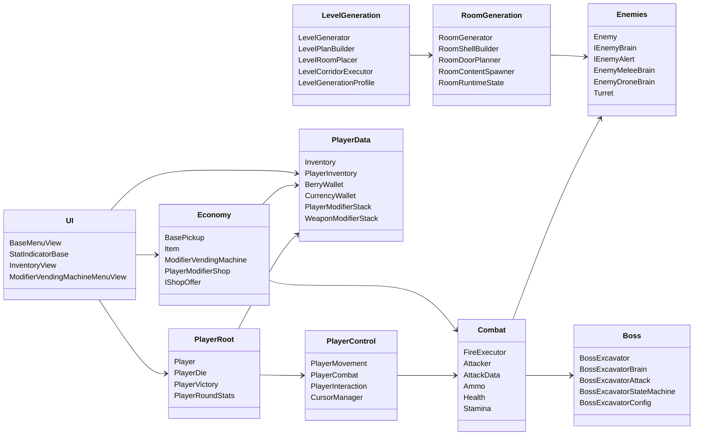
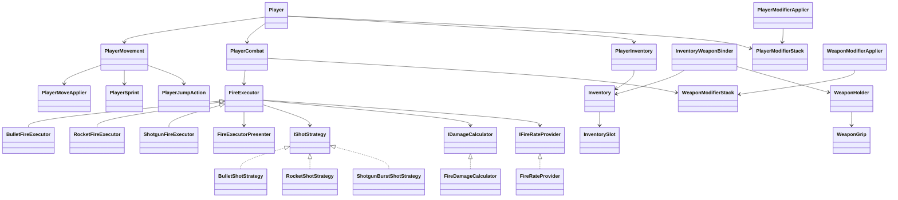
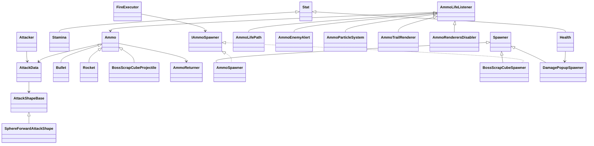
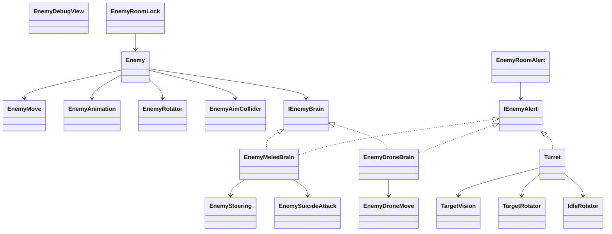
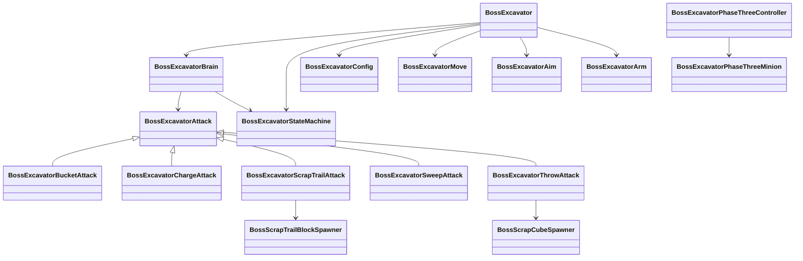

# Class Diagram

Диаграммы построены по игровому коду из `Assets/Scripts`.
Сторонние пакеты, `Library`, `Plugins` и автогенерируемые Unity-файлы не включены.

## Обзор подсистем

## Игрок, бой и инвентарь

## Стрельба, снаряды и урон

## Враги и босс

## Уровни и комнаты

```mermaid
classDiagram
    direction TB

    class LevelGenerator
    class LevelGenerationContext
    class LevelGenerationProfile
    class LevelSequenceProfile
    class LevelRoomPrefabLibrary
    class LevelPlanBuilder
    class LevelRoomPlacer
    class LevelRoomShellInstantiator
    class LevelRoomFinalizer
    class LevelCorridorExecutor
    class LevelCorridorBoundsBuilder
    class LevelRoomStreamer
    class LevelRuntimeNavMesh
    class RoomGenerator
    class RoomShellBuilder
    class RoomInteriorBlockFiller
    class RoomDoorPlanner
    class RoomPassagePlanner
    class RoomContentSpawner
    class RoomNookSpawner
    class RoomRuntimeState
    class RoomCombatLock
    class RoomEnterTrigger
    class RoomDoorGate
    class RoomDoorMarker

    LevelGenerator --> LevelGenerationProfile
    LevelGenerator --> LevelGenerationContext
    LevelGenerator --> LevelPlanBuilder
    LevelGenerator --> LevelRoomPlacer
    LevelGenerator --> LevelRoomShellInstantiator
    LevelGenerator --> LevelRoomFinalizer
    LevelGenerator --> LevelCorridorExecutor
    LevelGenerator --> LevelRuntimeNavMesh
    LevelGenerationProfile --> LevelSequenceProfile
    LevelGenerationProfile --> LevelRoomPrefabLibrary
    LevelCorridorExecutor --> LevelCorridorBoundsBuilder
    LevelRoomStreamer --> RoomRuntimeState

    RoomGenerator --> RoomShellBuilder
    RoomGenerator --> RoomDoorPlanner
    RoomGenerator --> RoomPassagePlanner
    RoomGenerator --> RoomContentSpawner
    RoomGenerator --> RoomNookSpawner
    RoomGenerator --> RoomRuntimeState
    RoomShellBuilder --> RoomInteriorBlockFiller
    RoomRuntimeState --> RoomCombatLock
    RoomEnterTrigger --> RoomRuntimeState
    RoomDoorGate --> RoomDoorMarker
```

## Предметы, модификаторы, магазин и UI

```mermaid
classDiagram
    direction TB

    class BasePickup
    class BaseAnimatedPickup
    class BerryPickup
    class CurrencyPickup
    class ItemPickup
    class PickupSpawner
    class PickupReturner
    class Item
    class ItemEffect
    class FoodEffect
    class WeaponModifier
    class WeaponTypeFilteredModifier
    class DamageMultiplierModifier
    class DamageMultiplierFilteredModifier
    class CriticalHitModifier
    class ProjectileSpeedMultiplierModifier
    class PlayerModifier
    class PlayerMultiplierModifier
    class PlayerHealthRegenUnlock
    class IShopOffer
    class ModifierOffer
    class PlayerModifierOffer
    class ModifierOfferPool
    class PlayerModifierPool
    class ModifierVendingMachine
    class PlayerModifierShop
    class ModifierVendingMachinePurchase
    class PlayerModifierPurchase
    class ModifierVendingMachineMenuView
    class PlayerModifierMenuView
    class ModifierOfferCardView
    class BaseMenuView
    class PauseMenuView
    class ExitMenuView
    class SettingsMenuView
    class StatIndicatorBase
    class HealthSmoothSliderIndicator
    class StaminaSmoothSliderIndicator
    class HealthTextIndicator

    BasePickup <|-- BaseAnimatedPickup
    BaseAnimatedPickup <|-- BerryPickup
    BaseAnimatedPickup <|-- CurrencyPickup
    BaseAnimatedPickup <|-- ItemPickup
    ItemEffect <|-- FoodEffect
    WeaponModifier <|-- WeaponTypeFilteredModifier
    WeaponModifier <|-- DamageMultiplierModifier
    WeaponTypeFilteredModifier <|-- DamageMultiplierFilteredModifier
    WeaponTypeFilteredModifier <|-- CriticalHitModifier
    WeaponTypeFilteredModifier <|-- ProjectileSpeedMultiplierModifier
    PlayerModifier <|-- PlayerMultiplierModifier
    PlayerModifier <|-- PlayerHealthRegenUnlock
    IShopOffer <|.. ModifierOffer
    IShopOffer <|.. PlayerModifierOffer
    BaseMenuView <|-- PauseMenuView
    BaseMenuView <|-- ExitMenuView
    BaseMenuView <|-- SettingsMenuView
    StatIndicatorBase <|-- HealthSmoothSliderIndicator
    StatIndicatorBase <|-- StaminaSmoothSliderIndicator
    StatIndicatorBase <|-- HealthTextIndicator

    ItemPickup --> Item
    Item --> ItemEffect
    PickupSpawner --> BasePickup
    BasePickup --> PickupReturner
    ModifierOffer --> WeaponModifier
    PlayerModifierOffer --> PlayerModifier
    ModifierOfferPool --> ModifierOffer
    PlayerModifierPool --> PlayerModifierOffer
    ModifierVendingMachine --> ModifierVendingMachinePurchase
    PlayerModifierShop --> PlayerModifierPurchase
    ModifierVendingMachineMenuView --> ModifierOfferCardView
    PlayerModifierMenuView --> ModifierOfferCardView
```

