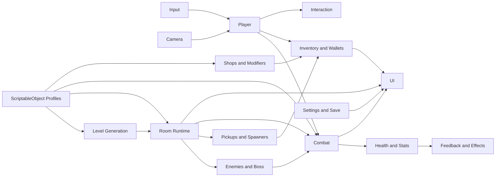
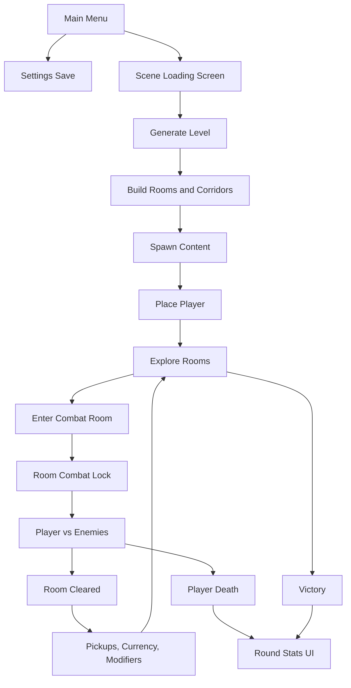
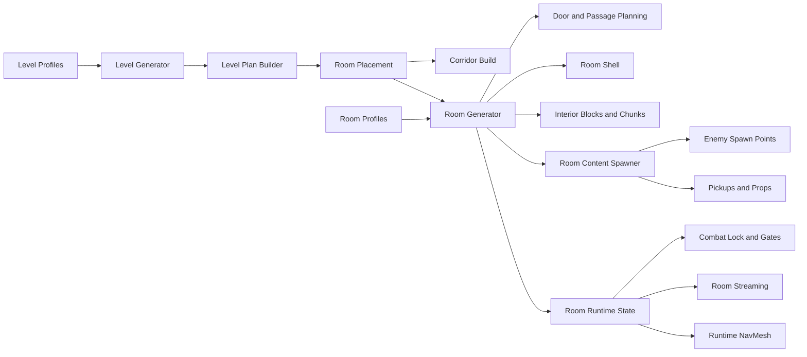
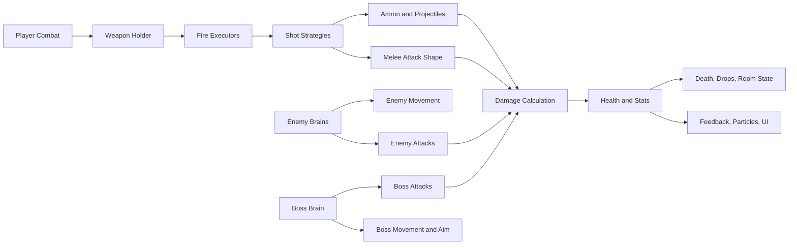
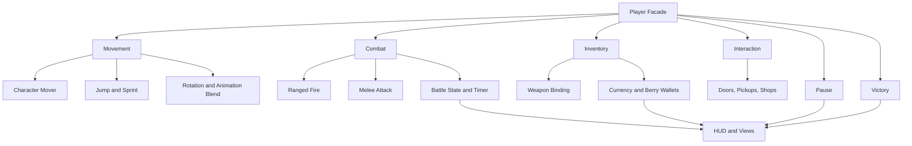
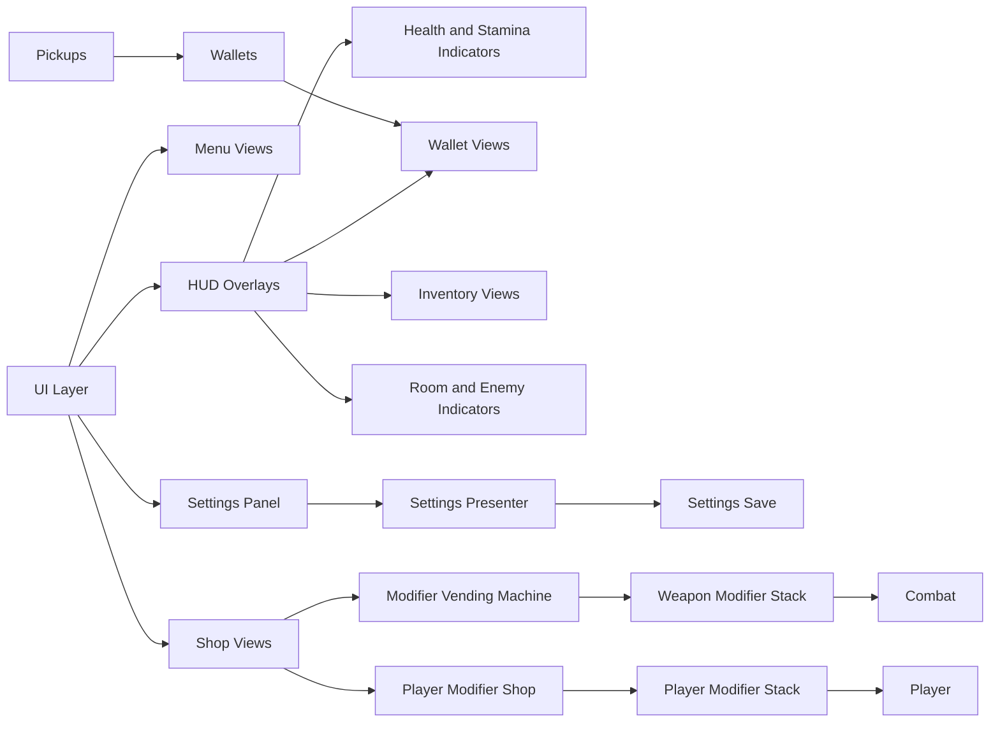
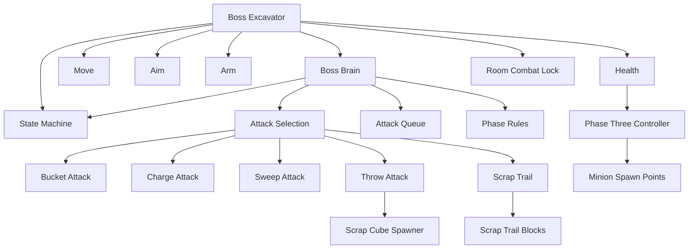

# Architecture Diagrams

Simplified architecture view. These diagrams intentionally do not mirror every class 1:1.
They show the main gameplay systems, data flow, ownership, and runtime dependencies.

## Overview

## Runtime Flow

## Level And Rooms

## Combat

## Player

## UI And Economy

## Boss

